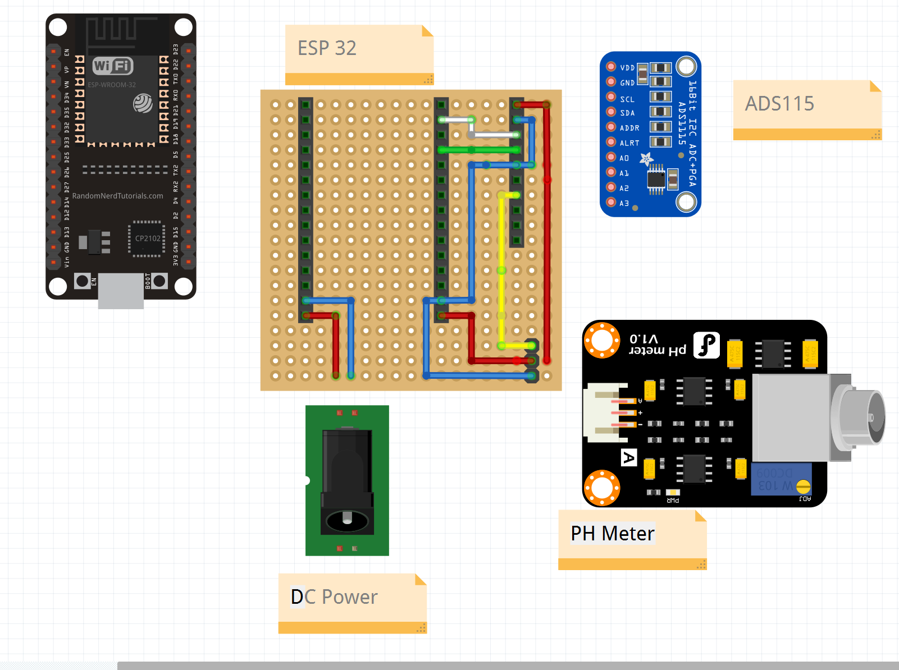

# PH Sensor

ESP32 connected to a PH Sensor and logging data into Home Assistant using ESP Home

# Parts List

- ESP32
- PH Probe, meter and two calibration fluids 
- 5V Regulated power supply
- Analog to Digital converter
- Pin Headers
- Perf board
- 22AWG wire
- pc mount barrel plug power connector


## ESP32
 The layout detailed is for the ESP32 30 Pin board

[](https://circuits4you.com/wp-content/uploads/2018/12/ESP32-Pinout.jpg)


## PH Sensor
DF Robot PH Sensor https://www.dfrobot.com/product-1782.html , cheaper alternatives are available on aliexpress but in testing have not been as reliable or long lasting 

## Calibration solutions
2 Calibration soloutions are required in order to determine the ph calculatation, the dfrobot comes with PH4 and PH7

## Power Supply
A seperate 5V DC power regulated power supply was required as when using the ESP32s 5V USB power supply the PH probe worked fine during development but with PH probe inserted into the pool pipe the signal fluctuated widely.

The ESP32 also performed fine when connected to a 9V DC regulated power supply

Using a seperate power supply the signal does tend to still vary when machinery is running on the same circuit but in the range of 0.1 PH

## Analog to Digital converted
ADS1115, The ADS1115 analog to digital converter is required as the inbuilt A2Cis not accurate enough.

## Pin Headers
Male and Female pin headers are required as part of making the board

## Perf board
A 5cm square 19x19 perf board is used for the layout, anything around that size would be fine

## 22AWG wire
For connecting parts.

## Power connector
A pc mount barrel plug power connector makes it easy to connect and disconnect the power supply as required.

# Board Layout

## Board Layout



## Board with devices attached


# ESPHome Code
In Home Assistant ESPHome add the i2C, ADS1115 and Sensor sections into your configuration.yaml


```yaml
esphome:
  name: ph-sensor
  platform: ESP32
  board: nodemcu-32s

# Enable logging
logger:

# Enable Home Assistant API
api:

ota:
  password: "xx"

wifi:
  ssid: "xx"
  password: "xx"

  # Enable fallback hotspot (captive portal) in case wifi connection fails
  ap:
    ssid: "Ph-Sensor Fallback Hotspot"
    password: "xx"

captive_portal:

i2c:
  sda: GPIO21
  scl: GPIO22
  scan: True
  
ads1115:
  - address: 0x48
sensor:
  - platform: ads1115
    multiplexer: 'A0_GND'
    gain: 6.144
    name: "PH Sensor"
    filters:
    - lambda: return x * -5.8252 + 15.767;
    unit_of_measurement: "Ph"
```


#Calibration
Gently dry the probe before swapping into different solutions
- insert probe into first PH solution and record the volatage 
- insert probe into second PH solution and record the volatage 

In Excel
- Enter the PH and voltages
- Chart the data, 
- Add a trend line
- Format the trendline to display the equation
- Use the equation to update the sensor lamda calculation


If the following measurements were recorded against calibration solutions

PH 4 -> 1.59825
PH 7 -> 1.10606

The formula would be -6.0952x+13.752


